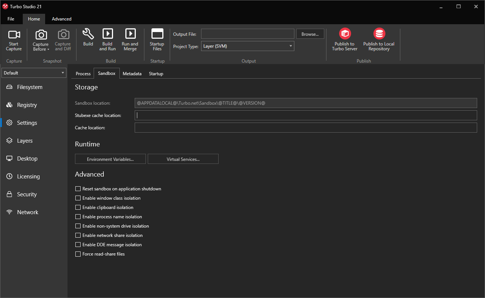
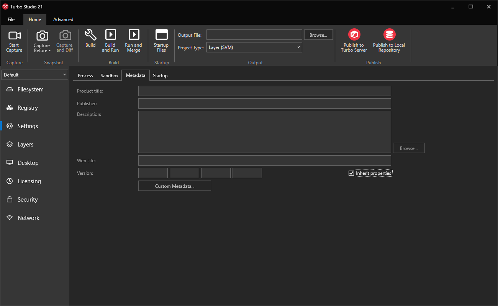
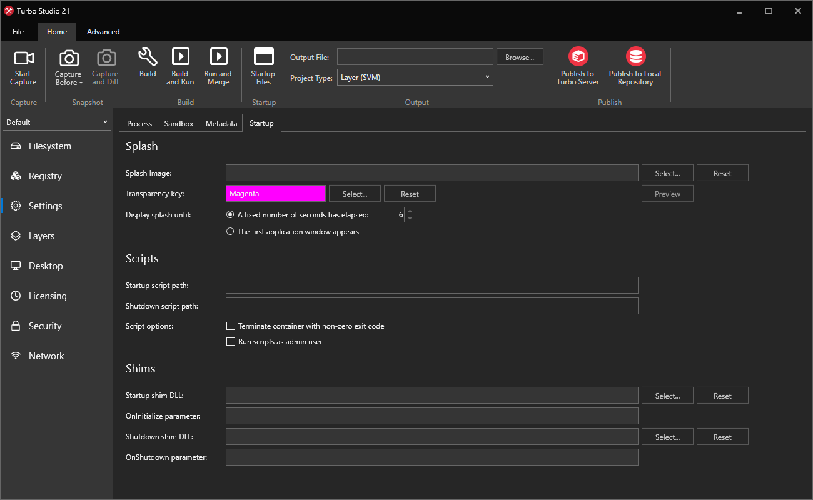
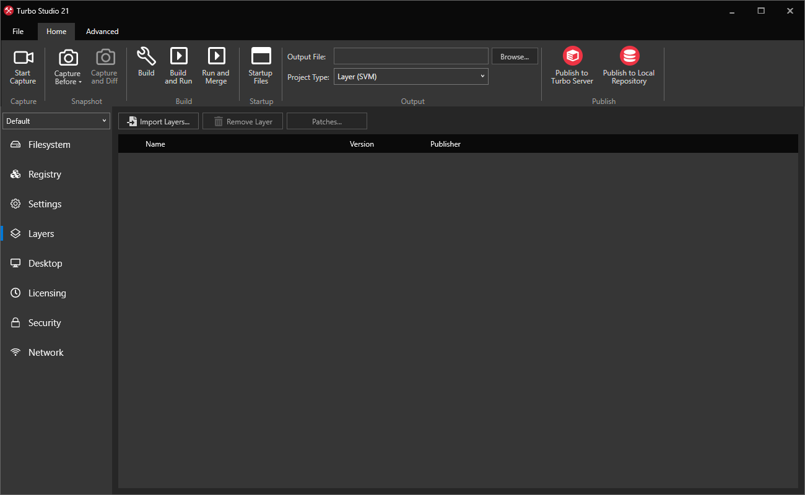
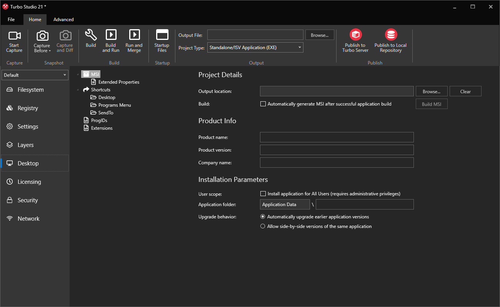
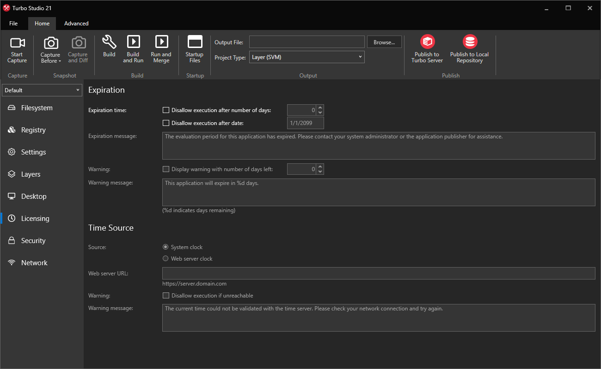
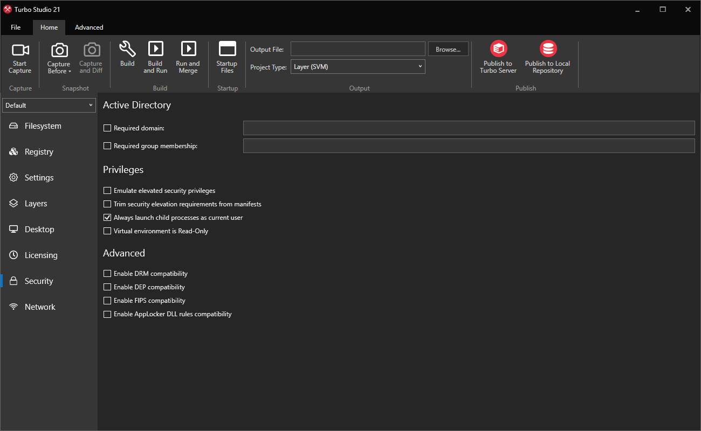
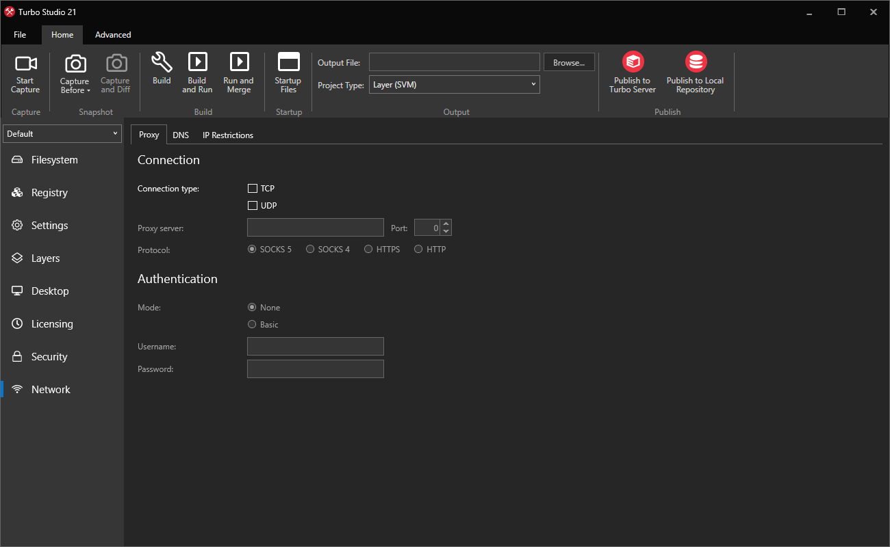
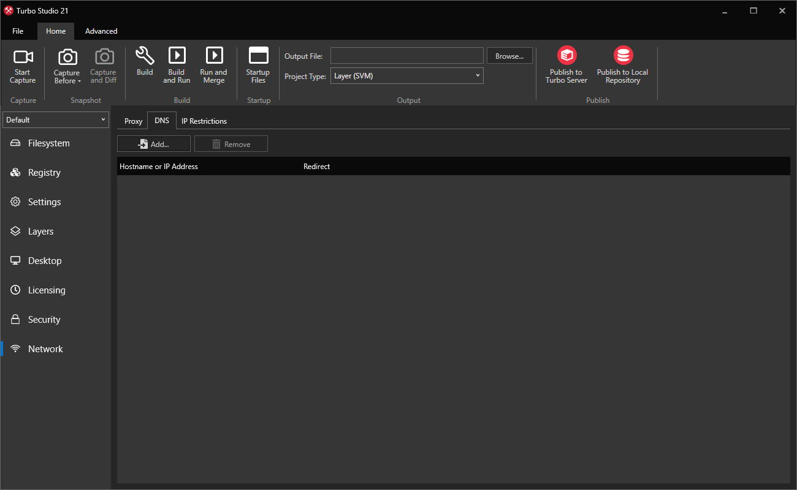
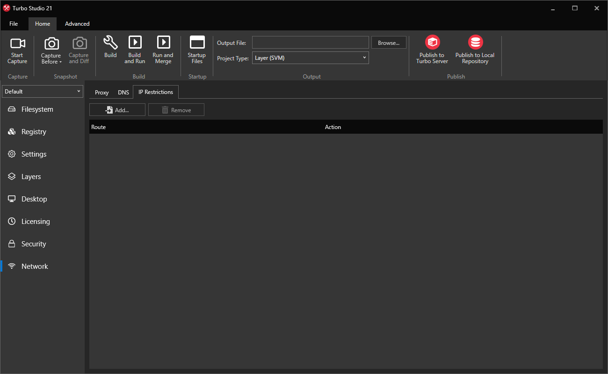

## Container Configuration

The following discusses the many configuration features available in Turbo Studio. These features allow you to edit and customize the settings for an image or virtual application configuration.

### Process Settings

- **Command line arguments** will be passed to the startup file when the container is executed by default. You can override and specify a fixed set of command line arguments to pass to the startup executable for **Standalone Executable** project types. Command line arguments can also be assigned directly to the startup files in the **Startup Files** dialog.
- **Working directory** allows you to specify what the default working directory of startup files will be. Options include the directory that the startup file is in (default), the directory that the container was executed from (useful for tooling that might take relative paths to files as parameters), or a specific location.
- **Target architecture** controls how wow64 redirection functions inside the virtual environment. If the configuration file was generated from a snapshot of an x86 machine then this should be set to **x86**. Otherwise this should be left as **x64**.
- **Minimum required OS** specifies the minimum required version of the Windows Operating System where the container will be allowed to run. If the requirements are not met then an error dialog is shown on container start.
- **Application type** specified which Windows subsystem is used for executable project types. This can either be **GUI**, **Console**, or **Inherit**. **Inherit** will determine the value for this field from the startup file executable.
- **Spawn child processes within virtualized environment** sets the default behavior for how native executables (those that are not inside the container configuratino) are handled in the container. They can either be spawned inside the container and therefore be subject to the configuration of the container environment, or they can be spawned outside the container and therefore not have access to files or registry inside the container.
- **Spawn COM servers within virtualized environment** specifies whether COM servers in the container are isolated from the native environment.
- **Child process exception list** is a list of executable files that will be excluded from the default spawn behavior. This is useful if certain system processes need to be spawned outside the container while everything else is kept inside (ie. print spooler, etc).
- **Compress payload** makes it so that the files stored in the container at build time will be compressed. This can greatly reduce the size of the container image or executable file. Enabling this setting will decrease performance as files must be decompressed at runtime and those over 1MB will be copied into the sandbox, even for read operations.
- **Use Windows DLL loader** allows the container runtime environment to use the Windows loader for executable file types (.dll and .exe). This has the advantage of increased compatibility but increases the filesystem usage requirements as all executable files must be faulted into the sandbox before they can be loaded rather than loading directly from the container image.
- **Trace process starts in debug output** will display a message in the debug output stream whenever a process is started. The debug output stream can be viewed with [dbgview](https://docs.microsoft.com/en-us/sysinternals/downloads/debugview).
- **Enable Turbo command line arguments** makes it so that the container runtime parameters can be used (ie /XEnable, /XShellEx, etc). See [building standalone executables](../../studio/working-with-turbo-studio/standalone-executables.html) for more information.
- **Enable startup executable optimization** makes it so that if there is a single startup file, then it will be run directly rather than being spawned from the virtual machine boostrap executable. This will reduce the number of processes that are required to start the container.
- **Shutdown process tree on root process exit** makes is so that all child processes of the startup file will automatically be killed when the startup file exists.
- **Enable Chromium suport** allows support for the Chromium sandbox used by Google Chrome, Microsoft Edge, and other applications and components.

### Sandbox Settings

- **Sandbox location** field specifies where the container's runtime sandbox will be stored during execution. This only applies to Standalone Executables and containers which are started using the Turbo Client Runtime will override this with its own behavior. This path can use the folder root tokens (ie **@DESKTOP@**, **@APPDATA@**, etc) as well as the following metadata variables: **@TITLE@**, **@PUBLISHER@**, **@VERSION@**, **@WEBSITE@**, and **@BUILDTIME@**. The container build time is in a format similar to **2008.02.01T08.00**. With the exception of the **@BUILDTIME@** variable (which is set automatically), these variables are based on the values specified in the **Properties** tab of **Settings** panel.
- **Stubexe cache location** field specifies where the container stubexe files are stored. By default this is blank and they are stored in the sandbox. Stubexe files are generated .exe files that map to executables which are launched inside the container. In some environment, stubexe files require exclusions for security or anti-virus software so it can be convenient to store them in the same place to reduce the exposure and complexity of exception rules.
- **Cache location** allows you to specify a location to store temporary container files. By default thse are stored in the user's temp directory.
- **Environment variables** allows to define custom environment variables that will be seen by applications inside the container. Options exist to control how variables are merged or overridden inside the container.
- **Virtual services** allow Windows services to be defined inside the container. Windows services are specialized applications that run in the background. They are typically responsible for providing system services such as database services, network traffic handling, web request processing, and other server functionality. Many applications install and require specific services in order to function properly.
- **Delete sandbox on application shutdown** makes it so that the sandbox folder is removed once the container stops. Enabling this setting will increase startup time as there are many files that are cached in the sandbox between runs.
- **Enable window class isolation** enables isolation for window classes. Window classes are a fundamental set of attributes that are assigned to an application window in the Windows operating system. These are often used to detect the presence of applications that are already running.
- **Enable clipboard isolation** enables isolation of the clipboard, preventing copy/paste operations from crossing container boundaries.
  Inheritance: this setting will be enabled in the container if any layer has it enabled.
- **Enable process name isolation** augments process names with the sandbox hash. This can be used for some applications which look for process names to enforce side-by-side constraints.
- **Enable non-system drive isolation** hides local drives other than the system drive where the operating system is installed.
- **Enable network share isolation** hides network shares on the system.
- **Enable DDE message isolation** prevents Dynamic Data Exchange (DDE) messages from crossing container boundaries.
- **Force read-share files** makes it so that all files in the container are opened in a way that doesn't block other processes from opening for read.

### Metadata Settings

- **Standard Metadata** fields include information such as product title, publisher, description, icon, web site URL, and version. By default these values are inherited by the startup file and will be displayed here. To override any of the values, uncheck the **Inherit** checkbox. Leave the value as **@INHERIT@** for any values that should continue to be inherited.
- **Custom Metadata** can be used by specialized external executable viewer applications, inventory scanners, and other asset and licensing management systems. For information on custom executable metadata, consult the Microsoft Windows Software Development Kit.

### Startup Settings

- **Splash Image** can assign an image that is displayed while the container is loading. Startup images improve application branding and are useful when the application requires several seconds to initialize.
- **Transparency key** enables the splash image to contain transparent regions which can improve the visual effectiveness of your splash.
- **Display splash until** assigns how the splash will be shown, either for a specific amount of time or until the first application window appears. The splash image can always be dismissed by clicking it with the mouse.
- **Shims** and **Scripts** settings allow you to run custom code to configure or clean up environments before and after a container is executed. See [Startup/Shutdown Scripts and Shims](../../studio/advanced-topics/startupshutdown-scripts-and-shims.html) for more information.
- **Startup script** assigns a path to a script that is executed when the container starts.
- **Shutdown script** assigns a path to a script that is executed when the container stops.
- **Terminate container with non-zero exit code** sets whether the exit code from the startup script is honored. If enabled, any non-zero exit code from the startup script will abort the container start (ex: `exit /b 1`). If disabled, the exit code from the script will be ignored. The default is disabled.
- **Run scripts as admin user** sets whether the scripts are to be executed in an administrator context. If enabled, the container startup will show a UAC prompt if the user is not already an administrator. The default is disabled.
- **Startup shim DLL** assigns a path to a shim DLL that is executed when the container starts.
- **OnInitialize parameter** is a string value which is passed to the startup shim.
- **Shutdown shim DLL** assigns a path to a shim DLL that is executed when the container stops.
- **OnShutdown parameter** is a string value which is passed to the shutdown shim.

### Layers Settings

The **Layers** panel allows external image layers (SVMs) to be merged into the configuration at build time. While this can be used for any of the project types, it is primarily used for standalone executable projects.

If the image output from the configuration is being used with the Turbo Client or Turbo Server then dependencies should be managed through those platforms directly and not by using external layer settings here.

External layers which are imported for use as build-time dependencies are copied to a local dependency cache. If the configuration is to be built on another machine or by a different user on the same machine, then the external layers must be imported again before the build will succeed.

External layers in the local dependency cache are loosely matched by name and version. If the external layer changes in any way (ex: isolation setting, new files, etc) but the name or version are not updated, then the new version will not be used unless it has been re-imported in all build environments.

For standalone executable project types, runtime patch layer dependencies can be set by clicking the **Patches...** button.

### Desktop Integration Settings

The **Desktop** panel allows shortcuts and file associations to be defined which are used when the container is installed to the machine via Turbo Client **install**, **installi**, or **subscribe** commands, from the Turbo Server portal, or with MSI deployments.

See [Desktop Integration](../../studio/working-with-turbo-studio/desktop.html) for more information on shortcut and file association configuration.

### Licensing Settings

- **Disallow execution after number of days** sets a hard limit on how many days the container can be executed. Useful for applications for trials or proof-of-concept.
- **Disallow execution after date** sets the date at which point the container no longer executes.
- **Expiration message** is the error message which is displayed when the container expires.
- **Display warning with number of days left** sets the number of days prior to expiration that a warning message is shown when the container starts.
- **Warning message** sets the message that is displayed when the warning is shown.
- **System clock** uses the machine time to determine expiration. If the machine time is modified then the expiration time can be affected.
- **Web server clock** uses the URL specified in the **Web server URL** field to determine the time used for expiration settings. This removes the possibility of the end-user changing their system time settings to extend the expiration but requires a network connection to the specified web server.
- **Disallow execution if unreachable** will prevent the container from executing if the web server clock URL cannot be reached.
- **Warning message** sets the message that is displayed when the unreachable warning is shown.

### Security Settings

- **Required domain** specifies the name of an Active Directory domain where the container must be executed. If the container is attempted to be executed off the domain then an error message will be displayed.
- **Required group membership** is a list of Active Directory groups to which the user executing the container must belong. Group names are semi-colon delimited.
- **Emulate elevated security privileges** makes it so that the processes in the container think they are running as admin when they are not. Since processes are running in a sandbox, writes to secure locations won't require administrative access.
- **Trim elevation from manifests** removes application manifest entries which result in UAC prompts. Useful if the elevation is no longer necessary because write operations to system locations are only in the container sandbox.
- **Always launch child processes as current user** makes it so that any processes spawn inside the container will inherit the current user's account privileges rather than any custom privileges that the parent process might assign.
- **Virtual environment is read-only** makes it so that all write attempts to files inside the container will return access denied errors.
- **Enable DRM compatibility** allows some DRM software (ie Armadillo variants) to function inside the container.
- **Enable DEP compatibility** hides Data Execution Prevention (DEP) settings on modern operating systems which can allow older applications to run in a container. Be aware of your company security policies before enabling this setting.
- **Enable FIPS compatibility** hides the container from any FIPS rules enforced on the machine. Useful for legacy applications which cannot be made FIPS compliant. The application security must be ensured by other means.
- **Enable AppLocker DLL rules compatibility** disables AppLocker DLL rules for the container applications. The application security must be ensured by other means.

### Proxy Settings

- **Proxy TCP connections** enables proxy settings for all TCP network traffic.
- **Proxy UDP connections** enables proxy settings for all UDP network traffic.
- **Proxy server** sets the proxy server to use for the specific protocols.
- **Protocol** specifies the proxy protocol to use. Valid options are **SOCKS5**, **SOCKS4**, **HTTPS**, and **HTTP**.
- **Authentication** specifies how the container authenticates with the proxy server. This can either be anonymous or plain-text username/password.

### DNS Settings

- **Hostname or IP Address** specifies the source name/address to map to another location.
- **Redirect** specified the target IP address where the source address is mapped to. Redirecting to IP 0.0.0.0 will make the source name/address unreachable.

### IP Restriction Settings

- **Route** is the hostname, IP address (v4 or v6 format, CIDR notation for subnet mask), or pattern to which the rule applies.
- **Type** sets whether the matching routes will be allowed or denied. All routes are allowed by default. To change this default add a route for "\*" set to **Deny**.
